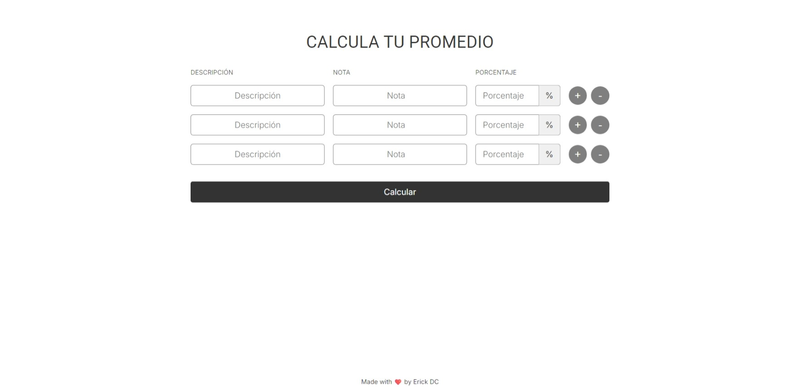

# Calculadora de Promedio de Notas
Esta es una aplicación web que permite a los usuarios calcular su promedio ponderado de notas. Los usuarios pueden ingresar múltiples notas y sus respectivos porcentajes, y la aplicación calculará el promedio basado en estas entradas. La aplicación también incluye validaciones para asegurar que los datos ingresados sean correctos y evitar errores comunes.

## Tecnologías
Esta página web fue realizada con las siguientes tecnologías:
- HTML5
- CSS3
- JavaScript
- React
- Vite

## Aplicación
#### Vista previa de la interfaz de la aplicación:

### Cómo Funciona
- Agregar Notas: Puedes agregar tantas notas como necesites haciendo clic en el botón "+".
- Eliminar Notas: Puedes eliminar notas haciendo clic en el botón "-", siempre y cuando quede al menos una fila.
- Ingresar Datos: En cada fila, ingresa la descripción de la actividad, la nota (entre 0 y 20) y el porcentaje (entre 0 y 100).
- Calcular Promedio: Haz clic en "Calcular" para obtener tu promedio ponderado. Si hay algún error en los datos ingresados, se mostrará un mensaje de error específico.

### Validaciones
- Notas: Deben ser valores entre 0 y 20.
- Porcentajes: Deben ser valores entre 0 y 100, y la suma de los porcentajes debe ser exactamente 100%.
- Parejas de Nota y Porcentaje: Si se ingresa una nota, debe ingresarse también un porcentaje y viceversa.
- Entradas Vacías: Al menos una fila debe tener valores válidos antes de calcular el promedio.

